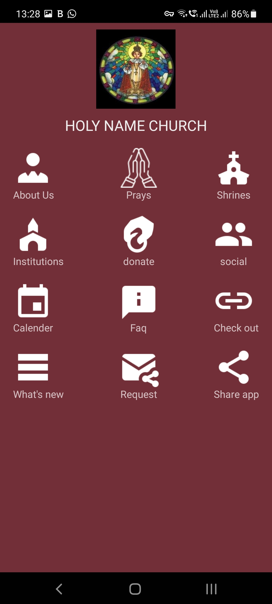
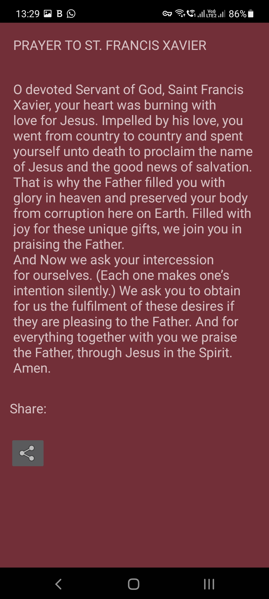
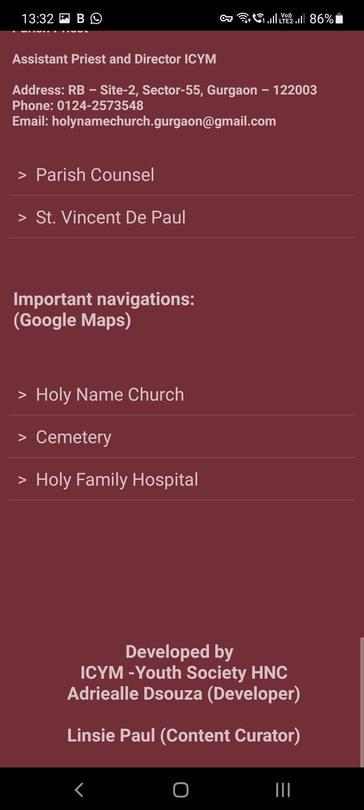
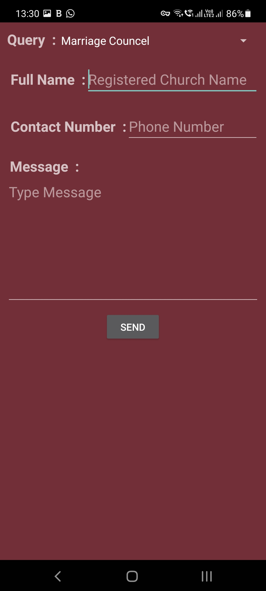
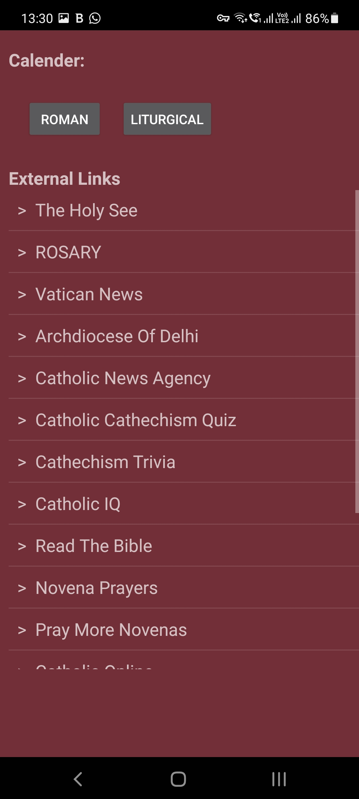

# holynamechurch
Made by Adriealle Dsouza
## PROJECT OBJECTIVE
An application which lists important prayers, bible links and other important information. Built using sqlite, fragments and xml to maintain light version.

[Click here to download the app/ check out the link in app-release.apk!](https://github.com/adriel1997/holynamechurch/blob/main/app-release.apk)
 

#### Fig: Loading page 

#### Fig: Menu page 

#### Fig: Prayer page 

#### Fig: About Us page 

#### Fig: Contact Us page 

#### Fig: Link page 

